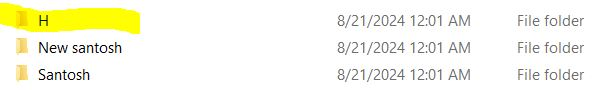

# 🗂️ File Renamer Utility in Python

Welcome to the **File Renamer Utility**, a simple yet powerful Python tool designed to help you rename multiple files in a directory with ease. Whether you're organizing your photos, documents, or any other files, this script will save you time and effort by automating the renaming process.

## ✨ Key Features

### 🛠️ Easy File Renaming
- **Batch Renaming**: Rename all files in a directory in one go.
- **Customizable Prefix**: Add a custom prefix to each file name.
- **Sequential Numbering**: Automatically add sequential numbers to file names.
- **Retain File Extensions**: Keep the original file extensions intact.

### 🖥️ User-Friendly Experience
- **Simple Setup**: Easy to configure and run.
- **Informative Output**: Provides a clear log of all renamed files.
- **Error Handling**: Safeguards against common issues like empty directories or invalid paths.

This utility is perfect for beginners learning Python, as well as anyone looking to automate their file management tasks.

## 🚀 Project Overview

### 🎯 Objective
Develop a Python script that renames all files in a specified directory by adding a prefix and sequential numbering while retaining the original file extensions.

### 💡 Features
- **Batch Renaming**: Rename multiple files at once.
- **Prefix and Numbering**: Add a prefix and sequential numbers to the file names.
- **Error Handling**: Prevents issues like overwriting files by mistake.

### 🛠️ Technology Stack
- **Python**: The programming language used to develop this utility.
- **OS Module**: Utilized for file and directory operations.

## 📝 Getting Started

### 🔧 Requirements
- **Python 3.x**: Ensure Python 3.x is installed on your system.

### 🚀 Running the Script

1. **Clone or Download the Repository**:
   ```bash
   git clone https://github.com/SantoshMalhi/file-renamer.git
   ```

2. **Navigate to the Project Directory**:
   ```bash
   cd file-renamer
   ```

3. **Configure the Script**:
   - Open the script file `file_renamer.py`.
   - Set the `directory` variable to the path of the directory containing the files you want to rename.
   - Set the `prefix` variable to your desired prefix (e.g., "image", "document").
   - (Optional) Set the `start_num` variable to the starting number for sequential numbering.

4. **Run the Script**:
   ```bash
   python file_renamer.py
   ```

5. **Check the Output**:
   - The script will display a log of all renamed files in the terminal.

### 📝 Example Usage
```python
# Example configuration in file_renamer.py
directory = "/path/to/your/files"
prefix = "file"
start_num = 1
```

Running the script will rename files in the directory as `file_1.ext`, `file_2.ext`, etc., where `.ext` is the original file extension.

## 📊 Example Output

### 🎛️ Sample Interaction
- **Before**:
 (IMG_003.jpg)

- - **After**: `file_1.jpg`, `file_2.jpg`, 

## 🌟 Connect with Me

- **GitHub**: [Santosh Malhi](https://github.com/SantoshMalhi)
- **LinkedIn**: [Santosh Kumar](https://www.linkedin.com/in/santoshkumarsk/)
